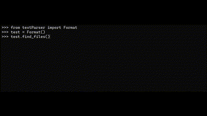

# Interview/Test

Welcome! This package was created as part of a job interview to demonstrate my abilities. It is designed to accept a date as user input and return a corresponding graphic. In its development, I strived to adhere to SOLID principles, ensuring each class has a single responsibility. I utilized `unittest` for testing edge cases. You are welcome to fork this repository and contribute to its development.

## Installation

You have two options: either navigate to the directory containing the package and run it from there, or choose to install the package directly.

```console
> python -m pip install textParser
```

## Usage

```python

>>> from textParser import Format
>>> test = Format()
>>> test.find_file('AprilsFool')
"/Holidays/Minor/logoAprilFoolsAni.gif"
```


```python

>>> from textParser import Format
>>> test = Format()
>>> test.find_files()
```



### Tests Cases
```python
class TextParserTest(unittest.TestCase): 
    
    def test_find_file(self):
        """Test if the file is found"""
        format = Format()
        self.assertEqual(format.find_file('AprilsFool'), '"/Holidays/Minor/logoAprilFoolsAni.gif"')
    
    def test_find_files_with_lowercase(self):
        """Test if the file is found with lowercase"""
        format = Format()
        self.assertEqual(format.find_file('christmas'), '"/Holidays/Christmas/Candle+SparklesAni.gif"')
    
    def test_find_files_with_dates(self):
        """Test if the file is found with dates"""
        format = Format()
        self.assertEqual(format.find_file('12/25'), '"/Holidays/Christmas/Candle+SparklesAni.gif"')
    
    def test_find_files_with_dates_and_year(self):
        """Test if the file is found with dates and year"""
        format = Format()
        self.assertEqual(format.find_file('02/5/2021'), '"/Holidays//Minor/2-1_logoWearRedDay.png"')
    
    def test_find_files_with_irregular_dates(self):
        """Test if the file is found with date using an incorrect format"""
        format = Format()
        self.assertEqual(format.find_file('2/4'), '"/Holidays//Minor/2-4_logoMailManDay.png"')
    
    def test_find_files_month(self):
        """Tests if all the files are found within the month"""
        format = Format()
        results = format.find_files_month('November')
        november = {
            '"/Holidays/Patriotic/11-11_VeteransDay.png"': False,
            '"/Holidays/11-28Thanksgiving.png"': False,
            '"/Holidays/11-3_DaylightSavingsAni.gif"': False,
        }
        for result in results:
            self.assertIn(result,november)
            november[result] = True
        self.assertTrue(all(november.values()))
    
    def test_overide_graphic(self):
        """Test if the correct file is found when the file is overriden"""
        format = Format()
        self.assertEqual(format.find_file('3/27/2021'), '"/Holidays/Minor/wny2.png"')

    def test_current_dates(self):
        """Test if the current date is found"""
        format = Format()
        self.assertEqual(format.find_file('12/31/2024'), '"/Holidays/logoFireworks.gif"')

    def test_word_input_dates(self):
        """Test if the word input is found ex. FourthThursday/November"""
        format = Format()
        self.assertEqual(format.find_file('fourththursday/november'), '"/Holidays/11-28Thanksgiving.png"')
```
### Possible errors

| Errors                  | Example     | Explanation                                                                                                                                                          |
|-----------------------|-------------|----------------------------------------------------------------------------------------------------------------------------------------------------------|
| Wrong Format     | Ex: `02-14-2022` | I hard coded some code so that it is specific to this document


